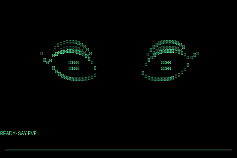
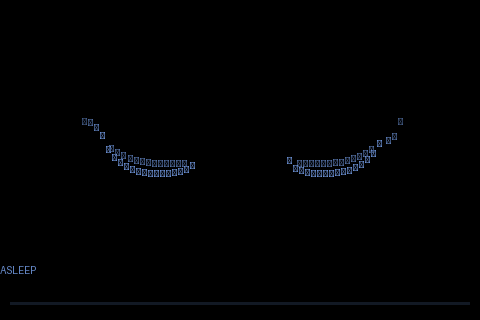
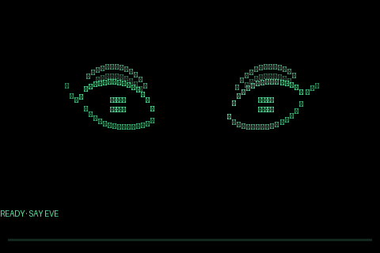

# hey-eve

Eve is an always-listening voice assistant for a Linux computer or Raspberry
Pi. Say “hey Eve”; local software detects speech and transcribes it, Claude
answers, and Kokoro speaks the reply. An optional 480×320 screen gives Eve an
animated face driven by state, speech timing, and touch.

The wake word, voice activity detection, transcription, speech synthesis,
memory files, reminders, and face all run on the host. Accepted requests,
bounded recent conversation history, remembered facts, and tool results are
sent to the Anthropic API. Web searches also run through Anthropic when the
model uses that tool.



## Supported live setup

The automated service installation supports 64-bit glibc Linux on `x86_64` or
`aarch64`, using CPython 3.11–3.13 and systemd 243 or newer. The tested
reference system is an 8 GiB Raspberry Pi 5 with 64-bit Raspberry Pi OS. A
host should have at least 4 GiB of RAM and 2 GiB of free storage. The face and
touchscreen are optional; a microphone and ALSA playback device are required
for the voice experience.

Install the host tools first. On Debian or Raspberry Pi OS:

```bash
sudo apt update
sudo apt install -y git curl cmake build-essential alsa-utils
```

Install [`uv`](https://docs.astral.sh/uv/getting-started/installation/), then:

```bash
git clone https://github.com/subjektz3ro/hey-eve.git
cd hey-eve
./deploy/install.sh
```

For a managed systemd installation, the resolved checkout, configuration,
`uv`, and `uv` cache paths may contain only ASCII letters, digits, `/`, `.`,
`_`, `+`, and `-`. The installer rejects whitespace, `%`, quotes, and
backslashes before it changes the environment; the documented default paths
satisfy this rule on a conventional Linux account.

The installer:

- checks the operating system, CPU architecture, glibc, Python, build tools,
  ALSA commands, and systemd prerequisites;
- syncs the locked Python environment;
- creates or preserves the owner-only settings file;
- downloads a pinned whisper.cpp revision and its `base.en` model;
- downloads the Kokoro model and voice bank plus the Silero VAD model;
- verifies every downloaded revision or SHA-256 digest;
- runs real Whisper, Silero, and Kokoro checks before installing or starting
  the service; and
- can install Eve as `eve@$USER.service`.

For reproducibility, the installer treats the selected settings file as
authoritative, ignores inherited assistant and uv project-selection overrides
other than `EVE_CONFIG_DIR`, and pins uv to this checkout and its `.venv`.
Direct manual runs still give an explicit process environment value precedence
over the settings file.

You will be asked for an Anthropic API key. Anthropic web search is a
server-side tool that an organization administrator can disable or restrict in
the Anthropic Console; search use is billed separately by Anthropic.

For a managed install, the installer already enables, starts, and verifies the
service. Check the local runtime and then inspect the running unit:

```bash
uv run eve doctor
systemctl status "eve@$USER"
journalctl -u "eve@$USER" -f
```

If you declined the systemd service, start Eve manually with `uv run eve`.

See [the deployment guide](deploy/README.md) for updates and service operation,
and [the hardware guide](docs/hardware.md) for microphones, speakers,
Bluetooth, the SPI display, and touch calibration.

## Development without hardware

The test suite does not need a Raspberry Pi, microphone, speaker, display,
model files, API key, or network access.

```bash
git clone https://github.com/subjektz3ro/hey-eve.git
cd hey-eve
uv sync --locked --dev
uv run pytest -q
uv run ruff check .
uv run mypy
```

To exercise a real Claude turn without audio or a display, put an API key in
`~/.config/eve/env`, then run:

```bash
uv run python -m eve.main --text --quiet --no-display
```

The face demonstrations can be regenerated without a framebuffer:

```bash
uv run python scripts/make-gifs.py
```

[`CONTRIBUTING.md`](CONTRIBUTING.md) lists the complete local and CI checks.

## How a turn works

```text
microphone -> Silero VAD -> whisper.cpp -> Claude + tools -> Kokoro -> speaker
                                          |                  |
                                          +---- 480×320 face-+
```

- **Silero VAD** distinguishes speech from background sound.
- **whisper.cpp** transcribes locally and checks for the wake phrase.
- **Claude** produces the answer and may call a small, bounded tool set.
- **Kokoro** synthesizes the response locally as 44.1 kHz mono PCM.
- **The face** shows listening, transcription, thinking, search, synthesis,
  playback, mute, sleep, and fault states.

The main boundaries are explicit Python protocols. `Transcriber` owns local
speech recognition and `Responder` owns a language-model turn, so either
backend can be replaced without changing the microphone, playback, or face
state machines.

## Capabilities

| Capability | Behavior |
|---|---|
| Answer questions | Claude receives addressed transcripts and returns short responses intended for speech. |
| Search the web | Anthropic's server-side search tool; limited to three uses per turn. |
| Inspect the host | Read-only temperature, uptime, load, memory, disk, and throttling information. |
| Inspect a BUSY Bar | Optional read-only Barkeep integration when `BARKEEP_TOKEN` is configured. |
| Remember facts | The model may store stable facts and preferences in a bounded local JSON file. |
| Set reminders | Bounded local reminders can speak later without another wake phrase. |

Memory is intentionally not a transcript. The model may automatically keep a
durable fact when it decides it will be useful later, even when the speaker did
not use the word “remember.” Use the `forget` tool or edit
`~/.config/eve/memory.json` to remove it. The store holds at most 40 facts of
200 characters each.

## The face

The optional face rasterizes directly into `/dev/fb0` as a 480×320 RGB565
framebuffer. `eve/head.py` contains behavior and timing; `eve/void.py` contains
the visual renderer.

The fracture pattern communicates state rather than audio volume. The face
separates while Eve is processing, converges as audio becomes available, and
reassembles during playback. Mouthless speech is represented with eye shapes
derived from syllables, punctuation, questions, numbers, and hedging language.

### Sleep and microphone state



The display distinguishes a deliberately muted microphone from a missing or
failed input when the capture device exposes its mute state. After a configured
mute interval Eve enters a visible sleep animation; a returning signal wakes
the face.

### Idle motion



The idle “bug” is a small two-body simulation rather than a fixed clip. The
face tracks the moving point and changes direction around the display.

### Touch


An ADS7846-compatible touchscreen can feed the same attention and avoidance
system. Calibration is performed with `scripts/touch-probe.py`; see
[the hardware guide](docs/hardware.md).

## Configuration

Settings live in `~/.config/eve/env`. Copy [`env.example`](env.example) for the
full annotated list. The installer creates this file with mode `0600` inside a
directory with mode `0700` and preserves it during updates.

Common settings:

| Variable | Default | Purpose |
|---|---|---|
| `ANTHROPIC_API_KEY` | none | Required language-model credential. |
| `BARKEEP_TOKEN` | none | Offers the optional read-only BUSY Bar status tool. |
| `BARKEEP_URL` | `http://127.0.0.1:8080` | Barkeep endpoint; non-loopback URLs require verified HTTPS. |
| `VOICE_MODEL` | `claude-haiku-4-5` | Anthropic model used for replies. |
| `VOICE_PERSONA` | `glados` | `glados` or `plain`. |
| `VOICE_PRESENT` | `female` | Chooses the default Kokoro voice. |
| `VOICE_TTS_VOICE` | presentation default | Any voice in the installed Kokoro bank. |
| `VOICE_VOLUME` | `1.0` | Output gain after normalization. |
| `VOICE_MIC` | discovered | ALSA capture device. |
| `VOICE_FOLLOW_UP_S` | `60` | Wake-word-free interval after a reply. |
| `VOICE_MAX_CAPTURE_S` | `300` | Backstop for one capture. |
| `VOICE_SLEEP_AFTER_S` | `600` | Muted interval before visible sleep. |
| `VOICE_TOUCH` | enabled when available | Enables touchscreen input. |
| `VOICE_SPEAKER_MAC` | none | Enables the optional Bluetooth reconnect timer. |
| `VOICE_DEBUG` | off | Writes transcripts and replies to the journal. |

The supported installer resolves model and configuration paths from this file.
Relative custom paths are resolved consistently by the application,
installer, verifier, and deployment script; `env.example` documents the exact
rules.

## Privacy and security

A request reaches Anthropic only when it is wake-addressed or begins during the
configured follow-up window. That turn also includes the bounded recent
conversation history, remembered facts, and any tool results. Other speech is
captured and transcribed locally but is not sent to Anthropic; the managed
service discards it after the wake check unless debug logging is enabled.

| Data | Storage and lifetime |
|---|---|
| Current capture | Random owner-only directory under `/dev/shm` on supported Linux; removed after normal turn cleanup, with tmpfs clearing abrupt leftovers at reboot. Other development platforms use their OS temporary directory and cleanup policy. |
| Transcripts and replies | Not written by the managed service unless `VOICE_DEBUG=1`; interactive runs print them to the terminal, whose scrollback or session logging may retain them. |
| Timings, token counts, and cost | systemd journal; installer can apply a 14-day/200 MB retention policy. |
| Remembered facts | `~/.config/eve/memory.json` until changed or forgotten. |
| Pending reminders | `~/.config/eve/reminders.json` until delivered or canceled. |
| Synthesized audio | Streamed to `aplay`; not written to disk. |

The recommended credential path is `~/.config/eve/env`. Credentials read from
that file are not exported to child processes. A credential supplied directly
as a process environment variable necessarily remains in that process
environment and can be inherited by children; use the settings file for the
service installation.

[`SECURITY.md`](SECURITY.md) documents the complete data flow, tool boundaries,
service permissions, reporting process, and remaining risks.

## Deployment and updates

`deploy/install.sh` is both the initial installer and the supported on-host
refresh path. It stops an active service before changing the checkout or
environment, then reruns all dependency and model checks before starting it.

Maintainers can deploy a commit already present on `origin/main` with:

```bash
./deploy/ship.sh --dry-run raspberrypi
./deploy/ship.sh raspberrypi
```

The deploy script checks the rendered systemd-unit contract, stops the service,
resets the host checkout to the requested commit, syncs the locked production
environment, repeats the model and inference checks, and starts the service.
Configuration and downloaded models live outside the checkout and are
preserved.

## Project layout

| Path | Role |
|---|---|
| `eve/main.py` | Process lifecycle and conversation loop. |
| `eve/speech.py` | ALSA capture/playback, pacing, and whisper.cpp adapter. |
| `eve/assistant.py` | Anthropic responder and bounded tool loop. |
| `eve/tts.py` | Kokoro synthesis and PCM normalization. |
| `eve/vad.py` | Silero voice activity detection. |
| `eve/head.py` | Face state, motion, and speech timing. |
| `eve/void.py` | 480×320 face renderer. |
| `eve/memory.py`, `eve/watch.py` | Bounded remembered facts and reminders. |
| `deploy/` | Reproducible install, service, verification, and deployment. |
| `tests/` | Hardware-free behavior and release contracts. |

## License and trademarks

Eve's original source is MIT-licensed. Dependencies and downloaded models
retain their own licenses; see [`THIRD_PARTY_NOTICES.md`](THIRD_PARTY_NOTICES.md).

The optional `glados` persona is an independent homage. GLaDOS and Portal are
properties of Valve Corporation. This project is not affiliated with Valve or
Anthropic.
